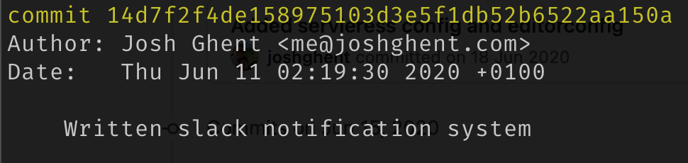

In the spirit of being a company that is ["built in public"](https://twitter.com/joshghent/status/1241997920058163201), I wanted to consolidate a number of tweets I've done since starting this project into a conclusive overview of how the TurboAPI system works. Additionally, I'll be speaking about why I made decisions I did.

## High Level Overview

### Frontend
TurboAPI has a web application for customers to configure their "monitors" (endpoints that they want monitoring for performance issues). This is built in React using react-router and hosted on Netlify. Authentication is handled with Auth0. In retrospect, I wish I had made this a little easier on myself (by going with Firebase or a different host) as I ran into lots of problems with authentication - to this day, if you login to TurboAPI and refresh it will not display the page. As front-end not my strength, I had my friend James do the design and large portions of the development. This sped the development up and motivated me to continue work on other parts of the system.

### API
The API is a typescript express API hosted on a Digitalocean server I already had running. I chose this for the sake of ease for deployment (it was the most similar environment to my local machine) and have since automated it all. To connect to the Postgres database, it uses TypeORM. Although this was great in the beginning, I've had to rewrite a lot of queries that I found to be slow. In particular `JOIN`'s are incredibly slow if you use the native library. Thankfully, you can pass plain SQL to TypeORM that doesn't have any of the validity checks on it (which is the slow bit).

The API took me the most amount of time because it's the central hub for everything.

### Job Runner
The "cronitor" is a lambda triggered by a cloudwatch cron (or timer, or whatever AWS call them now). It triggers every 60 seconds. It's so named cronitor because it's run on a cron and it monitors - it's like their celebrity couple name.

When the cronitor boots, it gets a special JWT token from Auth0 using it's bespoke permissions. This token allows it to call a private API endpoint that gets all the monitors that haven't ever been monitored (their new) or if the time they were last checked was more than 60 seconds ago. The cronitor then filters them down by removing any for customers that have invalid subscriptions and other such checks.

It then loops over these monitors and for each one, creates a new "Job" record in the database. It then emits this job record into a queue where it is picked up by the job runner lambda. This processes the job, by hitting the end point and measuring the delta in time between the request start and finish. We use the [`timer` functionality in the `request` library](https://jj09.net/properly-measuring-http-request-time-with-node-js/) to get this value as well as other metrics we measure to create a normalized value.

Job runner is also responsible for notifying the client if the job took longer than the threshold.

### Notifications system
This was written at 2am whilst sitting on my office floor, so I'm dreading going back to this code.

<div class="image">
	
</div>

Nonetheless, it works via Lambda and SQS. Essentially, a message is emitted from the task runner if the monitor takes longer than the customer defined threshold. It emits a message on the relevant queue that we want notifications on. These individual queues then trigger individual lambdas (although all the notifications code is part of one repo). This data is part of the message body that is sent to the task runner, to reduce database calls.
```js
{
	...
	notifications: [
		{type: "slack", url: "https://slack.com/xyz"},
		{type: "email", emails: "josh@turboapi.dev, support@turboapi.dev"}
	]
}
```

When there are multiple email addresses (as in the example above), we split the string on the comma and then send messages to the email queue for each email address.

The logic for this system is simple since it merely notifies the third party, and then shuts down.

## Plugging it all together
My goal when building any system is excellence. But, when trying to get a product to market, excellence has to take a back seat. I wouldn't say I sacrificed much code quality for the sake of delivery, however there are some rushed choices and lack of automation that will be a priority to improve on in the coming months. It wasn't the quickest MVP in history, but it wasn't the slowest. I've learnt a lot from the experience of building this product and believe that in the future, I'll be copying large portions of code into any new product I built to speed up that "laying the groundwork" stage. Primarily, it's shown me how much of a market there must be for developer tooling, especially in the early stages of product development.
Finally, I'm incredibly grateful to [AWS for giving me startup credits](https://aws.amazon.com/startups/) that have saved my wallet a number of times and DigitalOcean for their fantastic customer support.
